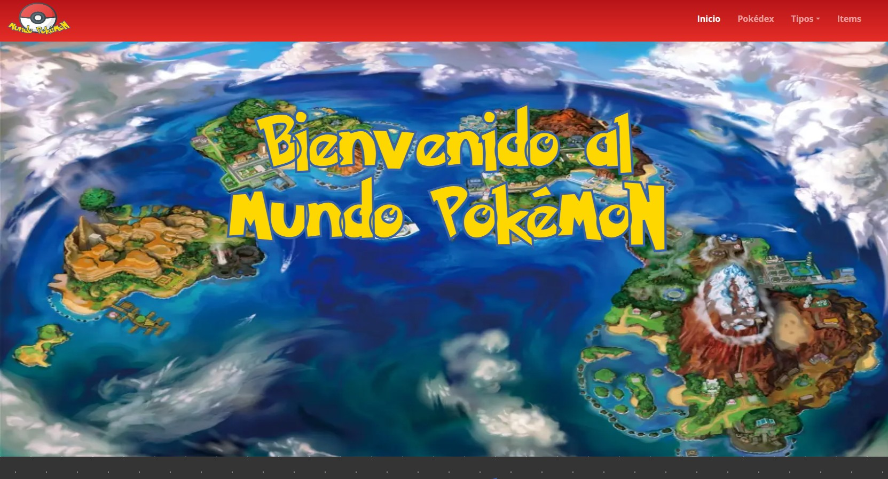
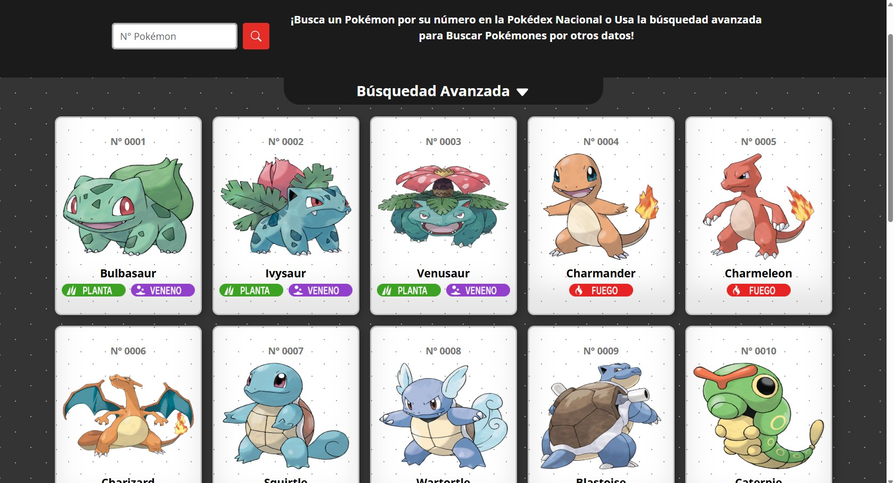
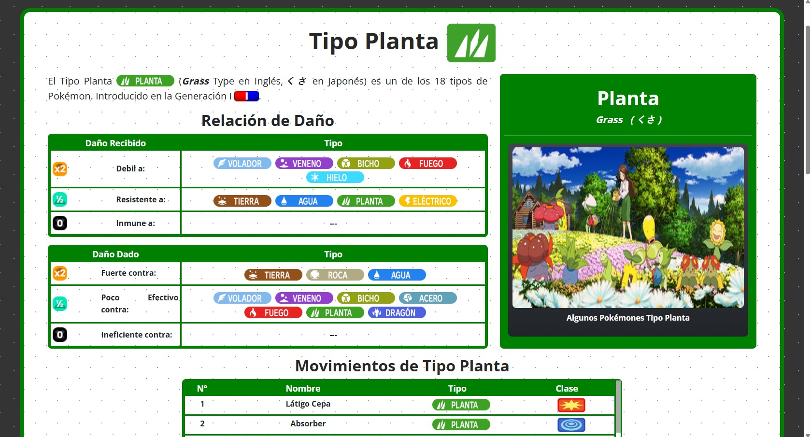

   

<h1 align="center">Pokemon World Project</h1>

React and Bootstrap Practice Project to learn API usage and consumption.

API used [PokeApi](https://pokeapi.co/)

## Run Locally

1. Clone the repo to you local device.
2. Install dependencies: `npm run install`.
3. Run the server: `npm run start`.
4. Open your browser and navigate to `http://localhost:5173/` to view th

### 🛠 &nbsp; Tools
- React 
- BootsTrap 

### 🧰 &nbsp; Main Modules

- [@popperjs/core](https://www.npmjs.com/package/@popperjs/core) 
- [axios](https://axios-http.com/es/) 
- [axios](https://axios-http.com/es/) 
- [bootstrap](https://getbootstrap.com/) 
- [bootstrap](https://getbootstrap.com/) 
- [react-icons](https://react-icons.github.io/react-icons/) 
- [react-infinite-scroll-component](https://www.npmjs.com/package/react-infinite-scroll-component) 
- [react-router-dom](https://reactrouter.com/) 

### Preview

 

 

 